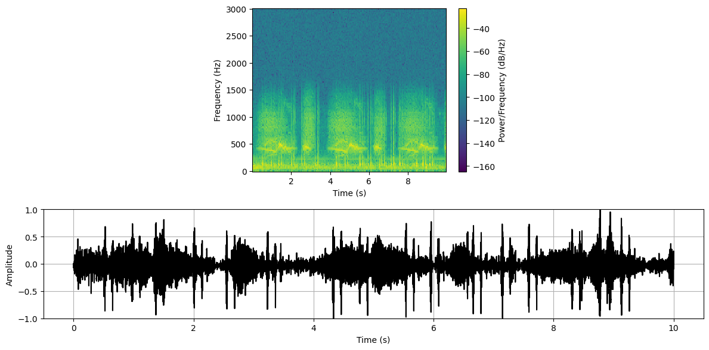

# LingoNMF
*Non-negative Matrix Factorization (NMF) Enhanced by Large Language Models (LLMs)  For Cardiorespiratory Sound Separation*
<p align="center"> 
 


## How to Run the Code

**Run the LingoNMF Jupyter Notebook**  
   Open Jupyter Notebook and run `LingoNMF.ipynb` to execute the code.

Or:

1. **Install Dependencies**  
   Install the required Python packages using:  
   ```
   pip install -r requirements.txt
   ```
2. **Run the Main Python Script**  
   Execute the main script using:  
   ```
   python main.py
   ```

## Citation:
If you use this code in your research, please cite:

- Torabi, Yasaman; Shirani, Shahram; Reilly, James P. (2025), Large Language Model-based Nonnegative Matrix Factorization For Cardiorespiratory Sound Separation, arXiv preprint, https://doi.org/10.48550/arXiv.2502.05757.
- Torabi, Yasaman; Shirani, Shahram; Reilly, James P. (2023), A New Non-Negative Matrix Factorization Approach for Blind Source Separation of Cardiovascular and Respiratory Sound Based on the Periodicity of Heart and Lung Function, arXiv preprint, https://doi.org/10.48550/arXiv.2305.01889.


If you use this dataset in your research, please cite:
- Torabi, Yasaman; Shirani, Shahram; Reilly, James P. (2024), 
Manikin-Recorded Cardiopulmonary Sounds Dataset Using Digital Stethoscope,
arXiv preprint, https://doi.org/10.48550/arXiv.2410.03280

© 2025 by Yasaman Torabi. All rights reserved.

